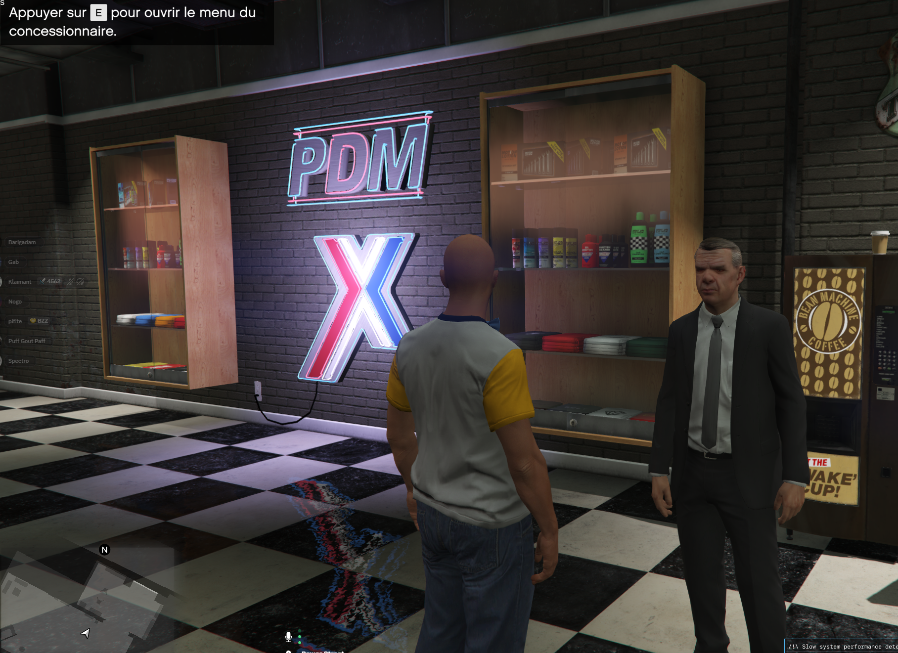
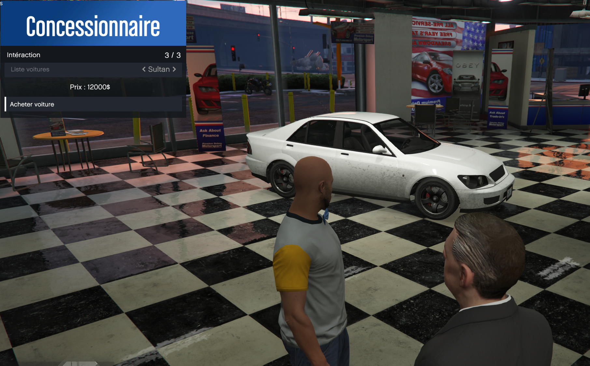
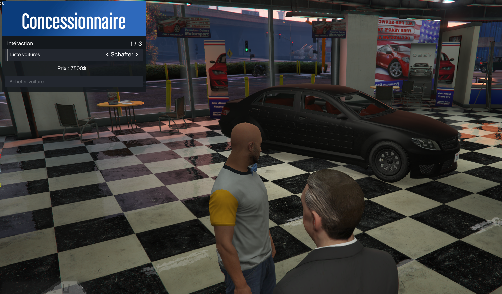
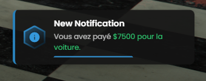

# 🚗 Car Dealership Script for FiveM

A comprehensive car dealership script for FiveM servers using the ESX framework. This resource allows players to purchase vehicles from an NPC dealer with an intuitive RageUI menu interface.

## 📋 Features

- **Interactive NPC Dealer**: A customizable NPC that handles all vehicle sales
- **RageUI Menu System**: Clean and modern menu interface for vehicle selection
- **Vehicle Preview**: Real-time vehicle spawning for customers to view before purchase
- **ESX Framework Integration**: Seamlessly integrates with ESX servers
- **Bank Account Integration**: Automatically deducts money from player's bank account
- **Database Integration**: Adds purchased vehicles to the `owned_vehicles` table
- **Automatic Plate Generation**: Generates unique license plates for each vehicle
- **Configurable Vehicles**: Easy configuration of available vehicles and prices

## 🛠️ Requirements

- **ESX Framework** (Legacy or 1.2+)
- **MySQL-async** or **oxmysql**
- **RageUI** (included in the resource)

## 📦 Installation

1. **Download** the resource and place it in your `resources` folder
2. **Add** the resource to your `server.cfg`:
   ```
   ensure car_deal
   ```
3. **Configure** the script by editing `config.lua`
4. **Restart** your server

## ⚙️ Configuration

Edit the `config.lua` file to customize your dealership:

```lua
Config = {}

-- Available vehicles with their display names, model names, and prices
Config.vehicules_label_list = {"Sultan", "Schafter", "Stratum"}
Config.vehicule_model_name = {"sultan", "schafter6", "stratum"}
Config.vehicules_price = {12000, 7500, 8000}

-- NPC Dealer configuration
Config.concess_ped = {
    model = "IG_Paper",  -- NPC model
    pos = vector4(-38.7606, -1095.5828, 26.4223, 155.2164)  -- Position and heading
}

-- Vehicle spawn location for preview and delivery
Config.vl_spawn_pos = vector4(-44.6425, -1099.0203, 26.4223, 333.4960)
```

## 🎮 How to Use

1. **Approach the NPC** dealer at the configured location
2. **Press E** when prompted to open the dealership menu
3. **Browse vehicles** using the list - preview vehicles will spawn automatically
4. **View the price** displayed in the menu
5. **Click "Buy Vehicle"** to purchase (money will be deducted from bank account)
6. **Collect your vehicle** - it will spawn with a unique license plate

## 🗄️ Database

The script automatically adds purchased vehicles to the `owned_vehicles` table with the following structure:
- **owner**: Player identifier
- **plate**: Generated unique license plate
- **vehicle**: JSON data containing model hash and plate
- **type**: Set to 'car'
- **stored**: Set to 0 (not stored in garage)

## 📱 Screenshots






## 🔧 Customization

### Adding New Vehicles

To add new vehicles, edit the config arrays:
```lua
Config.vehicules_label_list = {"Sultan", "Schafter", "Stratum", "New Car"}
Config.vehicule_model_name = {"sultan", "schafter6", "stratum", "newcar"}
Config.vehicules_price = {12000, 7500, 8000, 15000}
```

### Changing NPC Location

Modify the `Config.concess_ped.pos` coordinates to move the dealer NPC to a different location.

### Customizing the Menu

The menu uses RageUI and can be customized by modifying the `cli_main.lua` file.

## 🐛 Troubleshooting

**Vehicle not spawning after purchase?**
- Check that the vehicle model exists in your server
- Verify the spawn coordinates are not blocked

**Money not being deducted?**
- Ensure ESX is properly installed and running
- Check that the player has sufficient funds in their bank account

**NPC not appearing?**
- Verify the NPC model exists
- Check the coordinates in the config

## 📄 License

This project is licensed under the MIT License - see the [LICENSE](LICENSE) file for details.

```
MIT License

Copyright (c) 2025 Nogo4

Permission is hereby granted, free of charge, to any person obtaining a copy
of this software and associated documentation files (the "Software"), to deal
in the Software without restriction, including without limitation the rights
to use, copy, modify, merge, publish, distribute, sublicense, and/or sell
copies of the Software, and to permit persons to whom the Software is
furnished to do so, subject to the following conditions:

The above copyright notice and this permission notice shall be included in all
copies or substantial portions of the Software.

THE SOFTWARE IS PROVIDED "AS IS", WITHOUT WARRANTY OF ANY KIND, EXPRESS OR
IMPLIED, INCLUDING BUT NOT LIMITED TO THE WARRANTIES OF MERCHANTABILITY,
FITNESS FOR A PARTICULAR PURPOSE AND NONINFRINGEMENT. IN NO EVENT SHALL THE
AUTHORS OR COPYRIGHT HOLDERS BE LIABLE FOR ANY CLAIM, DAMAGES OR OTHER
LIABILITY, WHETHER IN AN ACTION OF CONTRACT, TORT OR OTHERWISE, ARISING FROM,
OUT OF OR IN CONNECTION WITH THE SOFTWARE OR THE USE OR OTHER DEALINGS IN THE
SOFTWARE.
```
